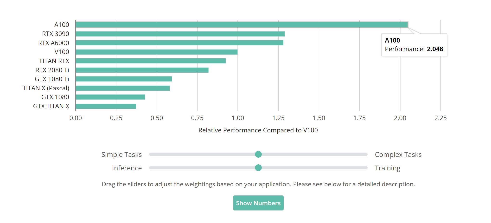

# Code for Deep Learning GPU Benchmark: A Latency-Based Approach

<p align="center"></p>

(Note that the above is a screenshot of the benchmark. Please visit the [project page](https://mtli.github.io/gpubench/) for the <i>latest version</i> and an <i>interactive experience</i>.)

This repo contains the timing scripts used in the GPU benchmark. This latency-based benchmark is designed to compare algorithms with runtime reported under different GPUs, and it also serves as a GPU purchasing guide. Please check out the [project page](https://mtli.github.io/gpubench/) for the complete benchmark with detailed descriptions. This page documents instructions on how to run the code and the changelog of the benchmark.


## Setting Up

```
git clone https://github.com/mtli/DLGPUBench.git
cd DLGPUBench
conda env create -f environment.yml
conda activate bench
```

Download and unpack ImageNet (ILSVRC2012) and MS COCO. For running the detection scripts, you also need to download the pretrained model from [this link](https://download.openmmlab.com/mmdetection/v2.0/faster_rcnn/faster_rcnn_r50_fpn_1x_coco/faster_rcnn_r50_fpn_1x_coco_20200130-047c8118.pth). Modify the dataset paths in each script you plan to run. 

## Changelog

### Version 1.1
- Update the timing setting for classification by excluding the time spent on GPU-host data transfer, and disabling multi-threading to make timing more stable and faster.
- Update to work with llcv 0.0.9.
- Change the default batch size for classification inference to 64
- Add results for GTX 1080 and RTX A6000.